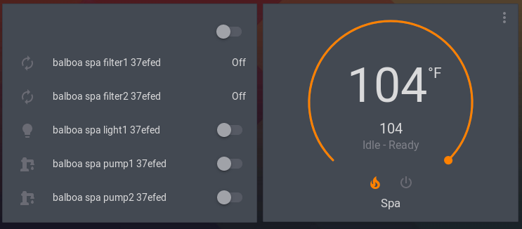

# Sundance Jaccuzi Spa Client integration for home-assistant
Home assistant integration for a Sundance 780 series and other Jaccuzi products equipped w and a
RS-485 to TCP COTS module such as elfin 11

## Configuration

TBD

## Screenshots

## Related Projects

* https://github.com/garbled1/pybalboa - Python library for local spa control
* https://github.com/plmilord/Hass.io-custom-component-spaclient - Another HASS custom component (and source of "spaclient" logos)
* https://github.com/ccutrer/balboa_worldwide_app - Fountain of knowledge for most of the messages sent from the spa wifi module
* https://github.com/natekspencer/BwaSpaManager - A SmartThings cloud-based solution
